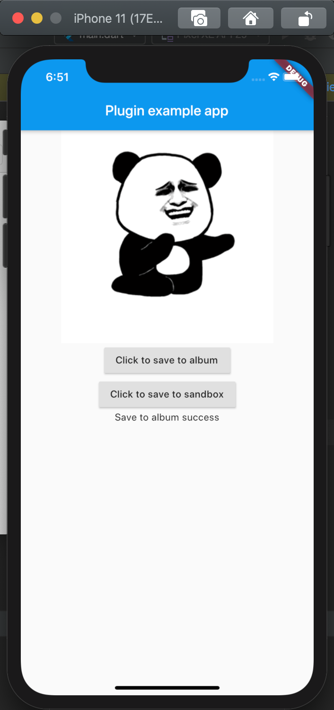

# image_save_example

Demonstrates how to use the image_save plugin.

## Usages

```
// Save to album.
bool success = await ImageSave.saveImage(data, "gif", albumName: "demo");

// Save to sandbox.
// Notice: Image saved in this way will be deleted when the application is uninstalled.
bool success = await ImageSave.saveImageToSandbox(data, "demo.gif");
```

## SCREENSHOT


